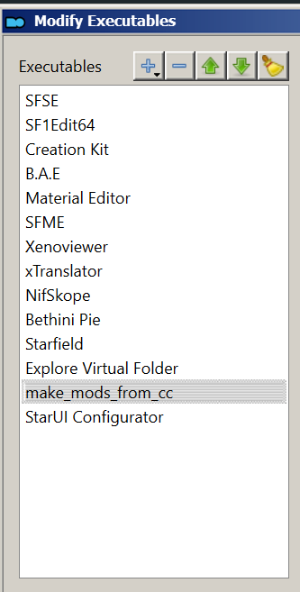
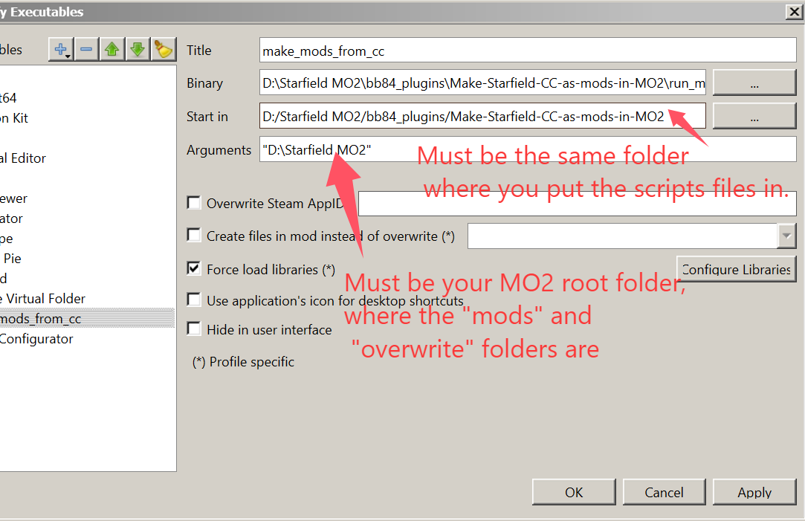
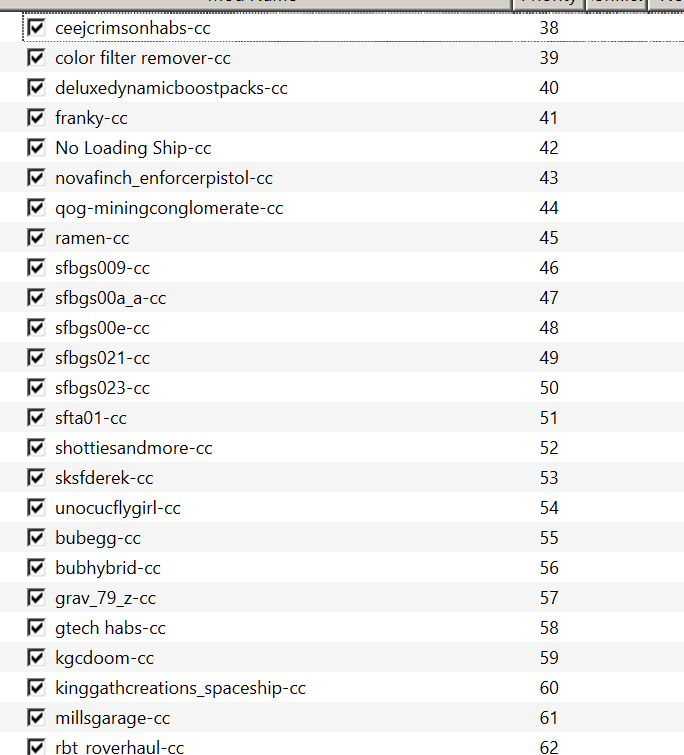

# To use 
Unzip to anywhere, but better to be a clean separate folder that only contains these two scripts. In your MO2, create new Executables:

Run the executable that just created, and refresh MO2, you should have something like this:

Meanwhile, all the original files are still in your "overwrite" folder. You need to delete them yourself, delete before checking. I can't be responsible for the deleting. 